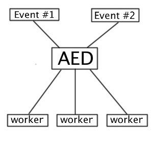

Async Event Dispatcher (AED)
============================

With this utility, you can send and receive Event at "asynchronous" mode.

..

    **Attention:** asynchronous work here as "lists" - Amqp for example.

How does it works?
------------------

You send the event to the event`s handler (Dispatcher) which already sends the event itself to the **Adapter**,
which is already working with the system "list", and sends the generated message to the queue or to the other systems.

Further, the application receives this message, which was signed at this event and starts its processing.

Currently already implemented the following providers:

* Amqp_

.. _Amqp: amqp.rst

Example of use:
---------------

Example of sending event:
~~~~~~~~~~~~~~~~~~~~~~~~~

.. code-block:: php

    <?php
    $adapter = ....; // Creating an adapter to send / receive of Events
    $asyncEventDispatcher = new \Ideea\AsyncEventDispatcher\EventDispatcher($adapter);

    // sending of Event
    $asyncEventDispatcher->dispatch('my_custom_event_name');

    // or object
    $event = new MyEvent(); // Event must be inherited from \Ideea\AsyncEventDispatcher\Event
    $event->foo = "Bar";
    $event->bar = "Foo";
    $asyncEventDispatcher->dispatch('my_custom_event_name', $event);

Example of getting event:
~~~~~~~~~~~~~~~~~~~~~~~~~

.. code-block:: php

    <?php
    $adapter = ....; // Creating a provider to send / receive's Event
    $asyncEventReceiver = new \Ideea\AsyncEventDispatcher\EventReceiver($adapter);

    // Running recipient
    $asyncEventReceiver->receive('my_custom_event_name', function (\Ideea\AsyncEventDispatcher\Event $event) {
        print "[+] event is received \n";
    }, 'receiver_id');

..

    **Note:** third argument is the key subscriber. If the key is not specified, and if there will disable
    subscriber-all Events for it will be removed.

During the reception event, the event is automatically marked as successfully delivered. If for some reason the event
can not be worked out, you have to put the flag meets both to the system does not support this event and resend it after
a while.

.. code-block:: php

    <?php
    // Running recipient
    $asyncEventReceiver->receive('my_custom_event_name', function (\Ideea\AsyncEventDispatcher\Event $event) {
        $status = ...; // Your logic
        if (!$status) {
            $event->setAcknowledge(false);
        }
    }, 'receiver_id');

Events
------

If necessary, you can create your own event, to pass the required parameters.

.. code-block:: php

    <?php

    use Ideea\AsyncEventDispatcher\Event;

    class MyEvent extends Event
    {
        public $foo;
        public $bar;
    }

    $event = new MyEvent();
    $event->foo = 1;
    $event->bar = 'foo';

    $eventDispatcher->dispatch('my_event', $event);

..

    **Note:** if you use handlers to completely separate system (server), make sure you Think about sync all files where
    there are Events. As one of the options - is the creation of a separate library where there will be all the events.

Demonization
------------

To demonize subscribers, you can use the Supervisor_.

.. _Supervisor: http://supervisord.org/
