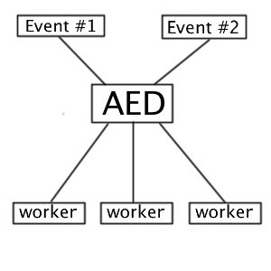

Async Event Dispatcher (AED)
============================

С помощью этой утилиты Вы сможете отправлять и получать ивенты (Events) в "ассинхроном" режиме.

..

    **Внимание:** ассинхроность здесь работает в виде "списков" - Amqp к примеру.

Как это работает?
-----------------

Вы отправляете event в оброботчик событий (Dispatcher) который уже отправляет сам event в **Adapter**, который уже
взяемодействует с системой "списка", и отправляет сгенерированное сообщение в очереди либо в инные системы.

Далее это сообщение получает приложение, которое было подписано на этот event и начинает его обработку.

На данный момент реализованы следующие провайдера:

* Amqp_

.. _Amqp: amqp.rst

Пример использования:
---------------------

Пример отправки события (Event):
~~~~~~~~~~~~~~~~~~~~~~~~~~~~~~~~

.. code-block:: php

    <?php
    $adapter = ....; // Создание адаптера для отправки/получение ивентов
    $asyncEventDispatcher = new \Ideea\AsyncEventDispatcher\EventDispatcher($adapter);

    // Отправка ивента
    $asyncEventDispatcher->dispatch('my_custom_event_name');

    // Либо объекта
    $event = new MyEvent(); // Ивент должен быть унаследован от \Ideea\AsyncEventDispatcher\Event
    $event->foo = "Bar";
    $event->bar = "Foo";
    $asyncEventDispatcher->dispatch('my_custom_event_name', $event);

Пример получение события:
~~~~~~~~~~~~~~~~~~~~~~~~~

.. code-block:: php

    <?php
    $adapter = ....; // Создание провайдера для отправки/получение ивентов
    $asyncEventReceiver = new \Ideea\AsyncEventDispatcher\EventReceiver($adapter);

    // Запуск получателя
    $asyncEventReceiver->receive('my_custom_event_name', function (\Ideea\AsyncEventDispatcher\Event $event) {
        print "[+] Получено событие\n";
    }, 'receiver_id');

..

    **Внимание:** 3-ий аргумент, это ключ подписчика. Если ключ не будет указан, то при отключении подписчика
    все ивенты для него будут удалены.

Во время приема события, событие автоматически помечается как успешно доставленное. Если по каким-то причинам событие
не может быть отработано, Вы должны поставить соответсвующий флаг, чтобы системы не подтверждала это события и повтороно
отправила его через некоторое время.

.. code-block:: php

    <?php
    // Запуск получателя
    $asyncEventReceiver->receive('my_custom_event_name', function (\Ideea\AsyncEventDispatcher\Event $event) {
        $status = ...; // Ваша логика
        if (!$status) {
            $event->setAcknowledge(false);
        }
    }, 'receiver_id');

Events
------

В случае необходимости, Вы можете создать свой собственный event, чтобы передать необходимые параметры.

.. code-block:: php

    <?php

    use Ideea\AsyncEventDispatcher\Event;

    class MyEvent extends Event
    {
        public $foo;
        public $bar;
    }

    $event = new MyEvent();
    $event->foo = 1;
    $event->bar = 'foo';

    $eventDispatcher->dispatch('my_event', $event);

..

    **Внимание:** если Вы использете обработчики на совсем отдельной системе (сервере), то объязательно задумайтесь об
    синхронизации всех файлов, где лежат ивенты. Как один из вариантов - это создание отдельной библиотеки, где будут
    находится все ивенты.

Демонизация
-----------

Для демонизации подписчиков, Вы можете использовать `Supervisor`_.

.. _Supervisor: http://supervisord.org/